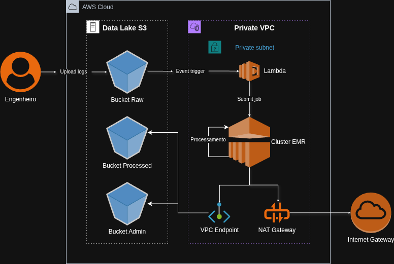

# AWS EMR Log Analytics Platform


## 📋 Overview

Plataforma de Engenharia de Dados **Event-Driven** projetada para ingerir e analisar logs de segurança em escala. A arquitetura utiliza **Terraform** para provisionamento imutável, **Amazon EMR** para processamento distribuído e **AWS Lambda** para orquestração serverless em tempo real.

### 🎯 Business Case
Em cenários de Cibersegurança, o tempo de reação é crítico. Analisar logs manualmente é inviável. Este projeto implementa um pipeline onde **o simples upload de um arquivo de log dispara automaticamente** todo o processo de ETL, permitindo a detecção de padrões e geração de relatórios minutos após a ingestão, com custo otimizado via instâncias Spot.
## 🏗️ Arquitetura da Solução



A plataforma implementa um **Data Lakehouse** modular na AWS, priorizando segurança e isolamento de recursos. O fluxo de dados segue o modelo de camadas (Medallion Architecture simplificada):

A plataforma segue o padrão **Lakehouse** com arquitetura reativa:

### 1. Camada de Armazenamento (Data Lake)
Utilizamos o **Amazon S3** segregado em camadas:
* **Raw Zone:** Recebe os logs brutos. Configurada com **Event Notifications** para disparar gatilhos.
* **Processed Zone:** Armazena dados convertidos para **Parquet** (Snappy), particionados para performance de leitura.
* **Administrative Zone:** Repositório de códigos (Scripts Spark, Bootstraps) e Logs de Auditoria.

### 2. Camada de Orquestração (Serverless)
Substituímos a execução manual por automação total via **AWS Lambda**:
* **Trigger:** Um evento `s3:ObjectCreated` no bucket Raw aciona a função Lambda.
* **Controller:** A função, escrita em Python (Boto3), identifica o arquivo e submete um Step (Job) dinâmico ao Cluster EMR.
* **Vantagem:** Custo zero quando ocioso e reação imediata à ingestão de dados.

### 3. Camada de Processamento (Compute)
**Amazon EMR 7.1.0** executando Apache Spark:
* **Engine:** PySpark utilizando funções nativas (sem dependência de internet para libs externas).
* **FinOps:** Estratégia de *Instance Fleets* (Master On-Demand + Core Spot) para reduzir custos em até 70%.
* **Security:** Cluster isolado em **Subnets Privadas**, sem acesso direto à internet (Zero Trust).

## 🚀 Quick Start

### Como Rodar (Ambiente Isolado)

Utilizamos uma **Toolbox** Dockerizada para garantir reprodutibilidade.

1. **Inicie a Toolbox:**
   ```bash
   docker compose run --rm toolbox
   ```

2. **Deploy da Plataforma:**
   ```bash
   cd infra/live/dev
   terraform init
   terraform apply -auto-approve
   ```


3. **Teste da Automação (Event-Driven):**
Basta fazer o upload de um arquivo para a pasta `logs/` do bucket Raw.
   ```bash
   # Exemplo via CLI (dentro da toolbox)
   aws s3 cp src/datagen/sample_access_log.txt s3://<SEU_BUCKET_RAW>/logs/teste_01.txt
   ```
   
*O Lambda detectará o arquivo e iniciará o processamento no EMR automaticamente.*

## 📚 Documentação

Este repositório serve como material de estudo. Para guias detalhados, acesse:

* **[Wiki do Projeto](../../wiki):** Contém o guia detalhado de configuração de ambiente, manuais de operação e detalhamento da infraestrutura.
* **[Architecture Decision Records (ADRs)](docs/adr/):** Histórico de decisões (ex: Por que Lambda? Por que Spot Instances?).