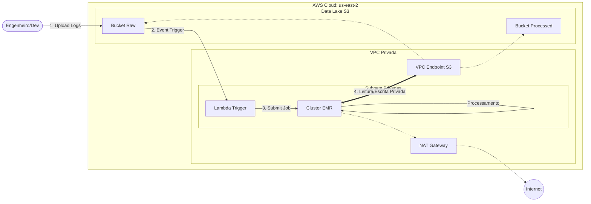

# AWS EMR Log Analytics Platform


## 📋 Overview

Plataforma de Engenharia de Dados *event-driven* projetada para ingerir e analisar logs de segurança (Web Server Logs) em escala. A arquitetura utiliza **Terraform** para provisionamento de infraestrutura imutável, **Amazon EMR** para processamento distribuído e **Apache Flink** para detecção de anomalias em tempo real.

### 🎯 Business Case
Em cenários de Cibersegurança, detectar ataques de força bruta ou padrões de negação de serviço (DDoS) horas depois do ocorrido é inútil. Este projeto reduz o "Time-to-Insight" processando logs assim que eles chegam ao Data Lake (S3), identificando IPs maliciosos e gerando alertas automáticos.

## 🏗️ Arquitetura


A solução segue o padrão **Lakehouse** com foco em **Zero Trust Networking**:
1.  **Ingestion:** Amazon S3 (Raw Zone) com triggers via AWS Lambda.
2.  **Compute:** Cluster EMR efêmero com instâncias Spot (FinOps).
3.  **Security:** VPC Customizada com Subnets Privadas (sem acesso direto à internet).
    * VPC Endpoints para tráfego S3 (sem NAT Gateway para dados).
    * Criptografia em repouso (KMS) e trânsito (TLS).
4. **Quality & CI:** Pipeline de Integração Contínua (GitHub Actions) validando segurança e formatação do Terraform a cada commit.

## 🚀 Quick Start

### Pré-requisitos
* Docker e Docker Compose instalados.
* Credenciais AWS configuradas em `~/.aws/credentials`.

### Como Rodar (Ambiente Isolado)

Não é necessário instalar Terraform ou AWS CLI na sua máquina. Utilizamos uma **Toolbox** containerizada para garantir reprodutibilidade.

1. **Inicie a Toolbox:**
   ```bash
   docker compose run --rm toolbox
   ```

2. **Dentro do container, faça o deploy:**
    ```bash
    cd infra/live/dev
    terraform init
    terraform apply
    ```
## 📚 Documentação

Este repositório serve como material de estudo. Para guias detalhados, acesse:

* **[Wiki do Projeto](../../wiki):** Contém o guia detalhado de configuração de ambiente (Docker Toolbox), manuais de operação e detalhamento da infraestrutura.
* **[Architecture Decision Records (ADRs)](docs/adr/):** Registros históricos de por que cada tecnologia e padrão de segurança foram escolhidos (ex: Networking, Storage).